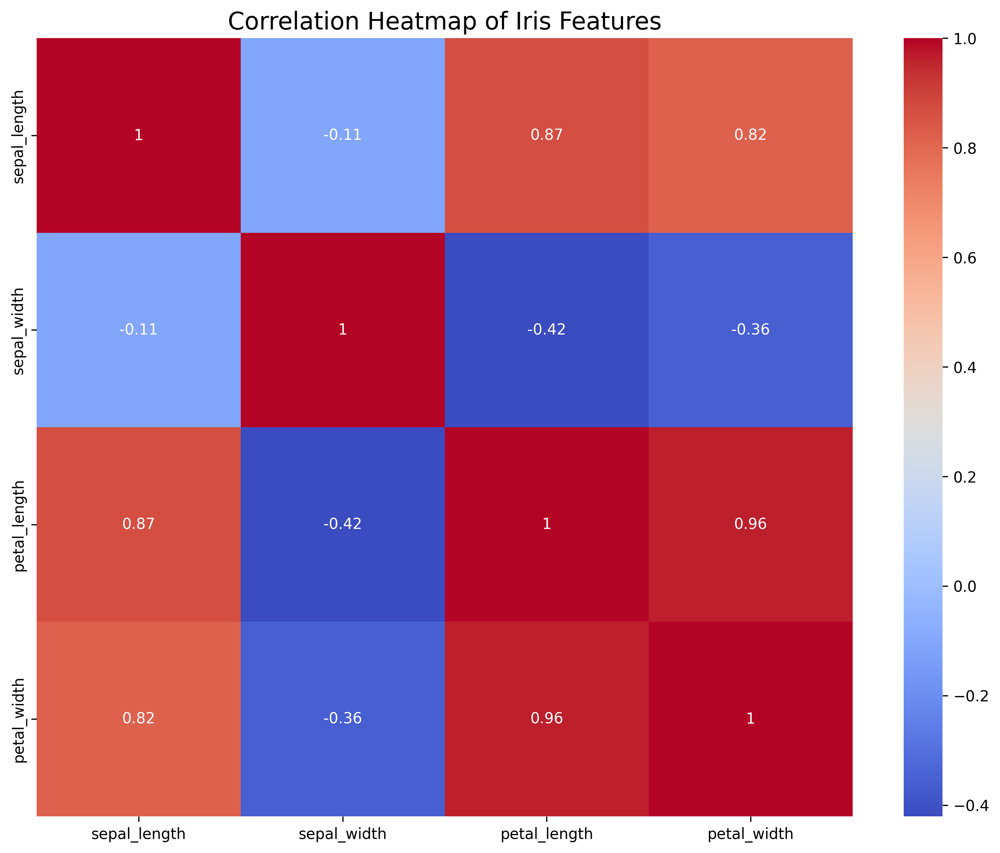
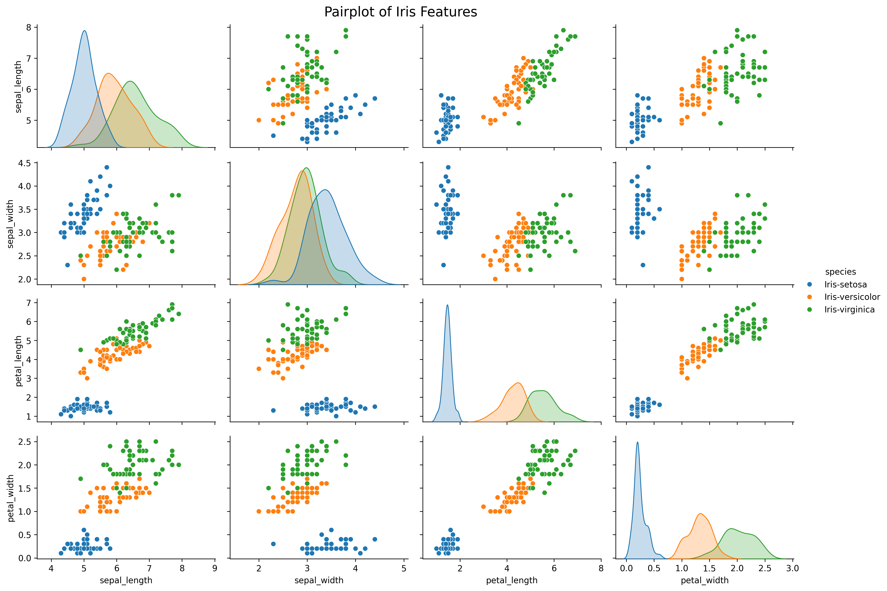
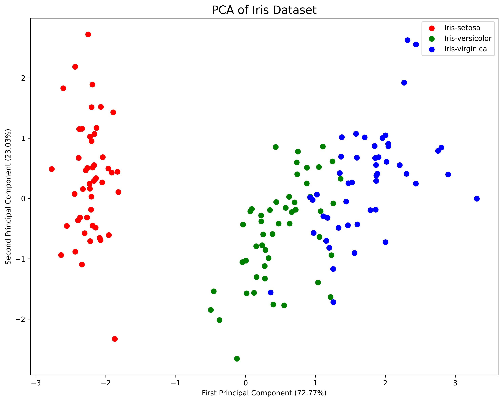

# Iris Data Analysis Project

## Overview
This project demonstrates a comprehensive analysis of the famous Iris dataset using Python. It showcases skills in data manipulation, visualization, and machine learning techniques, particularly focusing on exploratory data analysis and dimensionality reduction.

## Technical Skills Demonstrated
- **Python Programming**: Efficient use of Python for data analysis.
- **Data Manipulation**: Using Pandas for data loading and preprocessing.
- **Data Visualization**: Employing Matplotlib and Seaborn for creating insightful visualizations.
- **Machine Learning**: Applying Principal Component Analysis (PCA) for dimensionality reduction.
- **Statistical Analysis**: Calculating and interpreting correlation matrices and feature means.

## Libraries Used
- Pandas
- Matplotlib
- Seaborn
- Scikit-learn

## Dataset
The Iris dataset, a classic in the field of machine learning, contains 150 samples of iris flowers, each belonging to one of three species: setosa, versicolor, or virginica. Each sample has four features: sepal length, sepal width, petal length, and petal width.

## Analysis and Visualizations

### 1. Correlation Heatmap

**Analysis**: 
The correlation heatmap reveals strong positive correlations between petal length, petal width, and sepal length (0.87-0.96). Sepal width shows weak negative correlations with other features (-0.11 to -0.42). This suggests that petal dimensions and sepal length are closely related in iris species classification, while sepal width is less informative.

### 2. Pairplot

**Analysis**: 
The pairplot demonstrates clear clustering of iris species based on feature combinations. Setosa is distinctly separable, while versicolor and virginica show some overlap. Petal length and width exhibit the strongest differentiation between species. Sepal measurements show more overlap, with sepal width being the least discriminative feature. This visualization supports the potential for accurate species classification using these features, particularly petal dimensions.

### 3. Principal Component Analysis (PCA)

**Analysis**: 
The PCA plot reduces the four-dimensional feature space to two principal components, explaining 95.8% of the variance (72.77% and 23.03% respectively). Iris setosa forms a distinct cluster, while versicolor and virginica show some overlap. This suggests that the iris dataset is largely linearly separable, with setosa being the most distinguishable species. The high variance explained by two components indicates that dimensionality reduction is effective for this dataset, potentially simplifying classification tasks.

## Feature Means by Species
The project also calculates and saves the mean values of each feature for each iris species. This data is stored in `iris_feature_means.csv` and provides insights into the average characteristics of each species.

## Conclusions
1. The Iris dataset shows clear patterns of separation between species, particularly for the setosa class.
2. Petal dimensions are more informative for species classification than sepal dimensions.
3. PCA effectively reduces the dataset's dimensionality while retaining most of the variance, suggesting that simpler models might be sufficient for classification tasks on this dataset.

## Future Work
- Implement classification algorithms (e.g., SVM, Random Forest) to predict iris species.
- Explore other dimensionality reduction techniques like t-SNE for comparison with PCA.
- Conduct hypothesis tests to formally assess the significance of differences between species.

## How to Run
1. Ensure Python and required libraries are installed.
2. Run the script: `python iris_analysis.py`
3. Check the generated PNG files and CSV for results.

## Acknowledgments
- UCI Machine Learning Repository for the Iris dataset.
- The open-source community for the powerful Python libraries used in this project.
